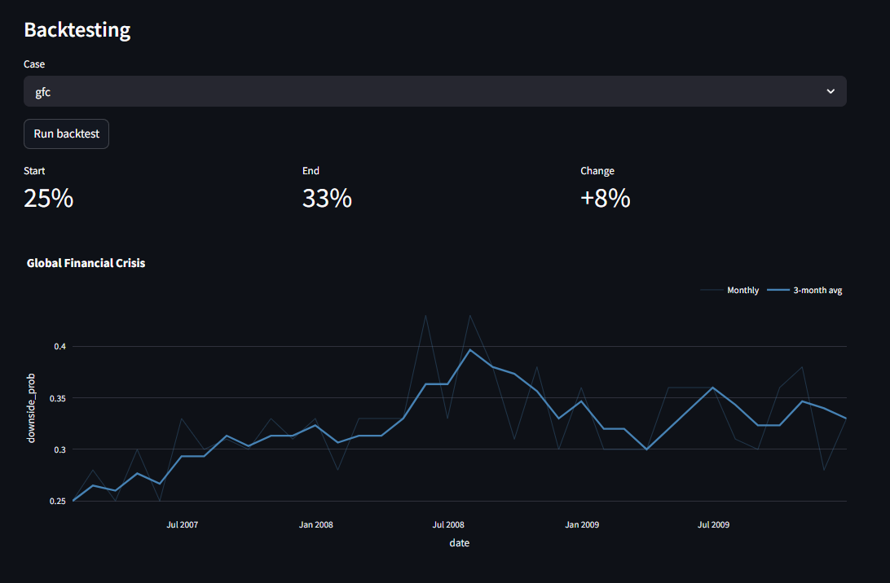
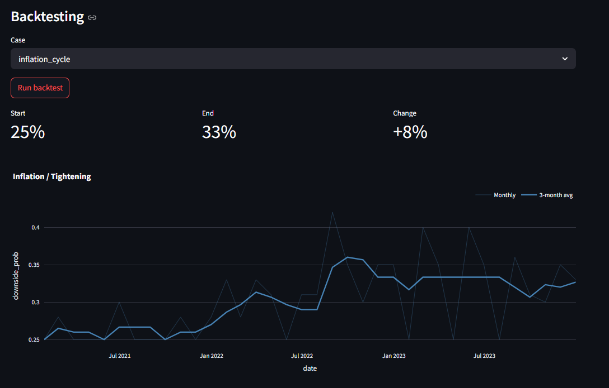
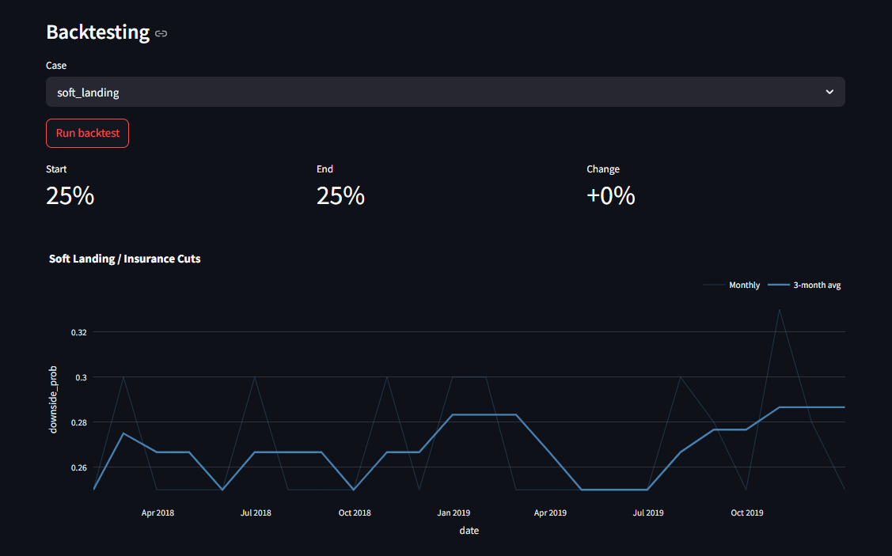

# Macro Analyzer

Macro Analyzer is a Streamlit-based macro decision engine that converts macro data into scores, dynamic weights, disciplined scenarios, triggers, reports, history, and backtests.

---

## Disclaimer

**This tool is for internal decision support and structured analysis only. It does not constitute investment advice, financial planning recommendations, or any form of client-directed guidance.**

If you are a registered investment adviser or financial professional:

- All outputs from this tool must be reviewed in conjunction with your own professional judgment, current market data, and applicable regulatory requirements before being used in any client-facing context.
- The scenarios, probability estimates, and regime classifications produced here are illustrative frameworks — not forecasts, predictions, or guarantees of future results.
- Historical backtest results do not predict future performance. The model is calibrated on two recession cycles (2001, 2008) and has known structural limitations documented below.
- This tool does not account for individual client circumstances, risk tolerance, investment objectives, or tax situation.
- Use of this tool does not create any fiduciary, advisory, or legal obligation between the tool's outputs and any third party.

Nothing in this tool should be shared with clients as a basis for investment decisions without independent professional verification.

---

## What it does

- Pulls primary macro inputs from FRED
- Scores constraint pressure and fragility
- Classifies momentum, regime, and system state
- Adjusts current module weights versus a structural base model
- Generates 3 core scenarios with probability ranges
- Applies trigger-based scenario adjustments
- Normalizes and validates probabilities
- Generates a short or long narrative report with the OpenAI API
- Stores runs in SQLite for history tracking
- Supports historical backtesting and threshold calibration

## Intended use cases

### What this tool IS good for

- **Structured conversation preparation**: Translate macro data into a consistent, documented framework before client meetings
- **Regime identification**: Systematically determine whether the current environment looks more like expansion, stress, or crisis — with an auditable rationale
- **Scenario framing**: Force explicit probability assignment across 3 mutually exclusive paths rather than anchoring on a single forecast
- **Trigger monitoring**: Get alerted when VIX, oil, or other signals cross thresholds that historically precede stress regime shifts
- **Historical context**: Quickly compare current macro conditions against prior stress periods (GFC, 2022 tightening cycle)
- **Discipline enforcement**: The model's rule-based structure reduces recency bias and anchoring when conditions are ambiguous

### What this tool IS NOT

- A trading signal or market timing system
- A replacement for fundamental analysis or sector research
- A real-time risk monitor (FRED data is monthly and backward-looking by 4–8 weeks)
- A probability forecasting engine — the scenario percentages are structured priors, not statistical estimates
- A substitute for fiduciary judgment in client-specific situations
- Calibrated for or applicable to individual securities, funds, or portfolios

---

## Structural base model

Base modules and default weights:

- Policy / Central Bank: 30%
- Growth / Macro: 25%
- Financial Conditions: 20%
- Energy / Geopolitical: 15%
- Political / Institutional: 10%

The base model is structural. Current weights change only when supported by rule-based logic tied to constraints, fragility, regime shifts, or active shocks.

## Data hierarchy

Primary scoring relies on official/public datasets from FRED. Market signals (VIX, WTI crude oil, gold) are pulled from FRED and Yahoo Finance to supplement the monthly macro data with daily market sentiment.

## Repo layout

```text
macro-analyzer/
├── app.py
├── config/
├── data/
├── engine/
├── llm/
├── ui/
├── exports/
├── backtesting/
├── scripts/
└── tests/
```

## Environment variables

Create a `.env` file in the project root:

```text
OPENAI_API_KEY=your_openai_key_here
FRED_API_KEY=your_fred_key_here
NEWSAPI_KEY=your_newsapi_key_here
```

`.env` is ignored by git. `.env.example` is provided as the template.

Get a free NewsAPI key at [newsapi.org](https://newsapi.org). The free tier allows 100 requests/day which is sufficient for normal use. If `NEWSAPI_KEY` is not set the app runs normally — the report just lacks live news context.

## News context

FRED data is backward-looking and cannot capture active geopolitical events, policy announcements, or market signals in real time. The news integration bridges this gap by fetching recent macro-relevant headlines at run time and injecting them into the LLM report prompt.

### What it does
- Fetches up to 8 headlines matching macro keywords (Federal Reserve, inflation, crude oil, geopolitical, recession, VIX, gold, yield curve, tariffs)
- Displays headlines in a collapsible panel above the dashboard
- Injects headlines into the LLM prompt so the narrative report can reference current events
- Accepts additional user-specified keywords and re-fetches on demand via the Refresh News button

### What it does not do
News headlines inform the narrative report only. They do **not** affect scores, weights, probabilities, triggers, or regime classification. The quantitative model stays clean and auditable. All model outputs are derived exclusively from FRED data and the user's manual shock input.

## Installation

```bash
python -m venv .venv
source .venv/bin/activate   # Windows: .venv\Scripts\activate
pip install -r requirements.txt
```

## Run the app

```bash
streamlit run app.py
```

## Run tests

```bash
pytest
```

## Notes on OpenAI API usage

The narrative report uses the OpenAI Chat Completions API (`client.chat.completions.create`). If `OPENAI_API_KEY` is missing, the app still runs the full analysis pipeline but report generation is disabled and replaced with a clear message.

## Recommended build order

1. Run the app locally with real FRED and OpenAI keys
2. Check the scoring and scenario outputs on live data
3. Expand the trigger set and the regime logic
4. Use the backtesting module to review directional behavior across historical periods
5. Push to GitHub after confirming `.env` is ignored

## Calibration methodology

### Data period
All constraint thresholds and scenario probability priors are calibrated against FRED data from **January 1996 to present**.

1996 was chosen as the start date because:
- It is the earliest date for which all required series are available (HY spread series `BAMLH0A0HYM2` begins 1996)
- It falls within the post-Volcker, inflation-targeting monetary policy regime
- It captures the full dot-com cycle buildup (1996–2000), which is necessary for pre-recession signal calibration

### Recessions included
Calibration uses NBER recession dates (`USREC` series) with the following treatment:

| Recession | Dates | Included |
|---|---|---|
| Dot-com / 9-11 | Mar 2001 – Nov 2001 | ✓ Yes |
| Global Financial Crisis | Dec 2007 – Jun 2009 | ✓ Yes |
| COVID-19 | Feb 2020 – Apr 2020 | ✗ Excluded |
| 2022–23 near-miss | — | ✓ Yes (as stress period) |

### Why COVID is excluded
The COVID recession is excluded from all calibration because:
- It was an exogenous supply shock with no macro imbalance buildup — pre-recession signals look nothing like a normal cycle
- The policy response ($5T+ fiscal stimulus, rates to zero in two weeks, unlimited QE) was historically unprecedented and non-repeatable
- The resulting 2021–2023 inflation was a direct artifact of that policy collision with supply chain collapse, not organic demand-pull inflation
- Including it would calibrate thresholds only relevant if COVID-scale stimulus is repeated

The COVID exclusion window is **February 2020 – December 2021**.

### Threshold derivation
Thresholds use a hybrid empirical + policy-anchored approach:

- **Pre-recession window**: 12 months prior to each NBER recession start date
- **Moderate threshold**: 25th percentile of pre-recession values (earliest point where pre-recession distribution diverges from normal)
- **High threshold**: 75th percentile of pre-recession values (clearly elevated stress territory)

**Core PCE is the exception.** Empirical values (1.87% / 2.19%) were rejected because inflation was not the causal driver of either the 2001 or 2008 recessions — those levels reflect incidental low inflation, not a binding policy constraint. Core PCE thresholds are policy-anchored to the Fed dual-mandate tolerance bands and the post-2000 historical 2-3% inflation norm:
- Moderate (2.5%): persistently above the 2% target, Fed becomes cautious
- High (3.0%): policy flexibility materially constrained

All other series (unemployment, HY spread, yield curve) use empirically derived values.

Run `python -m scripts.calibrate_thresholds` to regenerate empirical values from FRED data. Use `--write` to update `config/calibration.py`.

### Probability priors
Base scenario probabilities (Controlled Deceleration / Stabilization / Downside Break) start from priors of 45/30/25 and are adjusted at runtime by constraint and fragility scores. The historical recession rate since 1996 (ex-COVID) is approximately 7.6% — lower than the 25% downside prior because NBER recessions are short relative to the full cycle and the downside scenario captures stress periods beyond outright recession.

## Market signals

VIX, WTI crude oil, and gold are included as real-time market signals alongside the FRED macro fundamentals. Unlike FRED macro series which are monthly and backward-looking, these update daily and reflect current market sentiment.

### Data sources

| Signal | Source | Notes |
|---|---|---|
| VIX | FRED (`VIXCLS`) | Daily, real-time |
| WTI Oil | FRED (`DCOILWTICO`) | Daily, real-time |
| Gold | Yahoo Finance (GLD ETF) | GLD close × 10 ≈ gold spot $/oz. All FRED gold series are discontinued. Live and backtest gold both use Yahoo Finance — backtests fetch the full GLD history for the requested window. |

### How they feed into the model

| Signal | Feeds into | Mechanism |
|---|---|---|
| VIX | Fragility — liquidity score | VIX > 20: liquidity fragility = 1. VIX > 30: liquidity fragility = 2 (crisis) |
| WTI Oil | Fragility — energy dependency + energy/geo weight | High oil = input cost pressure + automatic energy_geo weight increase |
| Gold (YoY%) | Fragility — institutional score | Rising gold = institutional risk-off = loss of confidence signal |

### Impact on probabilities

Market signals affect probabilities **indirectly** through the fragility score:
- Higher fragility → heavier weight on financial and policy modules
- Fragility >= 7 triggers a direct downside probability adjustment (+10%)
- Max fragility is 8 (leverage 1 + liquidity 2 + energy 2 + correlation 1 + institutional 2)

### Oil and the energy/geo weight

Oil price drives the `energy_geo` module weight automatically:
- Oil > $75/bbl: energy_geo weight +5% (moderate pressure)
- Oil > $95/bbl: energy_geo weight +10% (severe pressure)

### Threshold decisions

| Signal | Threshold basis |
|---|---|
| VIX | Market convention (globally accepted: 20 = elevated, 30 = crisis) |
| Oil | Judgment-anchored to post-2005 shale-era supply dynamics ($75, $95) |
| Gold YoY | Judgment-anchored (15% = elevated safe-haven demand, 30% = crisis-level) |

## Backtesting

The backtesting module reruns the full model pipeline (constraint scoring, fragility, regime classification, scenario probabilities) against historical FRED data for a set of pre-defined periods. For each month in the period it computes the Downside Break probability midpoint and plots how it evolved over time.

The chart displays two lines: the faint thin line is the raw monthly score; the bold line is a 3-month rolling average. **Read the bold line.** The monthly line shows the threshold oscillation that is a structural property of hard-threshold scoring. The 3-month average filters that noise and reveals the underlying trend — which is the meaningful signal.

### Included backtest cases

| Case | Period | Rationale |
|---|---|---|
| Global Financial Crisis | 2007–2009 | Full credit cycle with pre-recession buildup — the primary validation case for threshold calibration |
| Inflation / Tightening | 2021–2023 | Tests model behavior during a post-COVID inflation regime with aggressive Fed tightening |
| Soft Landing / Insurance Cuts | 2018–2019 | Tests model behavior in a low-stress expansion with pre-emptive Fed cuts |

### Observed backtest behavior

**Global Financial Crisis (2007–2009)**



The 3-month average shows a steady climb from 0.25 in early 2007 to ~0.40 by mid-2008, followed by sustained elevation through 2009. The model correctly tracked the slow deterioration through 2007 as credit conditions frayed, stepped up sharply when Bear Stearns was rescued (March 2008) and Fannie/Freddie nationalized (July 2008), and stayed elevated as the recession was confirmed. Net change: +0.08. This is the model's strongest validation case — the shape, timing, and direction all align with the actual macro sequence.

**Inflation / Tightening (2021–2023)**



The 3-month average sits flat at 0.25 through all of 2021 — FRED data was still showing post-COVID normalization and the policy constraint had not yet fired. From early 2022 it climbs steadily to ~0.35 by mid-2022 as core PCE crossed thresholds and the Fed began aggressive hikes. It then holds elevated at 0.33–0.35 through 2023 because the yield curve inversion and policy constraint remained in place even as inflation was falling. This illustrates an important model property: the constraint score responds to whether pressure has *resolved*, not just whether the direction has improved. Net change: +0.08.

**Soft Landing / Insurance Cuts (2018–2019)**



The 3-month average stays flat at 0.26–0.28 for the entire period with a mild drift to ~0.29 in late 2019 (repo market stress, three insurance cuts). Net change: 0. This is the correct result — there was no recession and no sustained macro deterioration. The raw monthly line shows oscillation between 0.25 and 0.30 driven by the yield curve spread hovering near the 0.52% threshold, but the rolling average correctly reads through it as a stable, low-stress expansion.

### How to read the backtest output

- **Direction and shape matter more than the absolute level.** Flat = stable, rising and holding = building stress, declining = relief.
- **A net change of +0.08 in the GFC looks the same as +0.08 in the inflation cycle** — but the paths are completely different. Read the chart, not just the summary numbers.
- **The model does not predict recessions.** It identifies when macro conditions have moved into territory that historically precedes stress. Whether that stress leads to a recession depends on factors (policy response, external shocks, timing) that the model does not capture.
- **The 3-month average is the signal. Monthly spikes above the average are real but transient.** A spike that doesn't sustain in the rolling average is a single noisy data point, not a trend.

### COVID excluded from backtesting

The COVID shock (2019–2021) is excluded from backtest cases for the same reason it is excluded from calibration: it was an exogenous supply shock with no macro imbalance buildup. The model's thresholds were derived without COVID data and are not designed to handle that regime.

### Current limitations of the backtest module

The current implementation tracks only the Downside Break probability over time. It does not:
- Score whether scenario calls were correct against realized outcomes
- Measure early warning lead time before recession onset
- Evaluate regime classification accuracy
- Compare model performance against a baseline

This is a known limitation. The module is currently a visualization tool, not a full validation framework.

## Known limitations

Understanding these limitations is essential before relying on any output from this tool.

### 1. Lagging indicators

The primary data source is FRED. Most FRED macro series (Core PCE, unemployment, HY spreads) are reported monthly with a 4–8 week publication lag. The model is structurally backward-looking. It can identify that stress has built up but it will not signal the beginning of a crisis in real time. During the 2007–2009 backtest the model correctly tracked the slow deterioration through 2007–early 2008, but the sharpest stress (September–October 2008) was not the model's best moment — the financial system was moving faster than monthly data.

### 2. Threshold instability near boundaries

All scoring uses hard thresholds: a series either crosses a boundary or it does not. When a series hovers near a threshold it can cross in and out monthly, producing oscillating scores. This is most visible in the 2018–2019 soft landing backtest: the yield curve spread repeatedly crossed the 0.52 moderate threshold, causing the model to alternate between Turbulence and Expansion regimes month to month. This is a structural property of hard-threshold scoring, not a data error. The backtest chart mitigates this visually with a 3-month rolling average, but the underlying scores remain binary.

### 3. Narrow probability range

The Downside Break scenario typically ranges between 0.25 and 0.38 across most environments. The model does not produce near-0% or near-100% estimates by design — scenario floors (e.g., 0.20 minimum downside) prevent extreme probability readings. This is intentional for communication discipline but means the raw probability numbers do not behave like a calibrated statistical forecast. Treat the direction and relative level (rising vs. falling, elevated vs. low) as the signal — not the absolute number.

### 4. Small calibration sample

Thresholds are derived from two recession cycles: 2001 and 2008. This is an inherently small sample. The model cannot claim statistical robustness — it claims structural logic anchored to the most relevant historical analogs available. Any threshold recalibration should proceed cautiously and document the reasoning for each change.

### 5. Geopolitical shocks are manually overridden

The model has no automated geopolitical signal. Active conflicts, sanctions, and supply disruptions (e.g., Strait of Hormuz closure, energy embargo) must be entered manually via the shock severity override in the sidebar. If this is not updated the model will remain in a macro-data-only regime and miss the geopolitical dimension entirely. Use the news refresh and shock classifier suggestion as a prompt, but verify independently.

### 6. Model does not know what it does not know

The rule set is compact. Novel macro regimes — a sovereign debt crisis in a G7 country, simultaneous supply and demand shocks, debt deflation — may not be captured. When the macro environment looks structurally different from 2001 or 2008, treat model outputs with additional skepticism.
